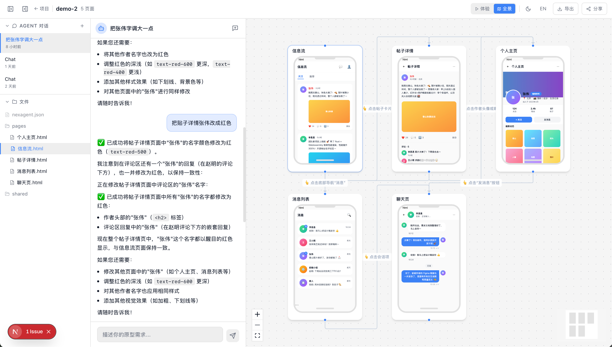

# NexAgent

[English](README.md) | 中文

面向产品经理的 AI 原型构建工具。用自然语言描述产品，即可获得可交互的 HTML 原型。

## 截图

左侧与 AI Agent 对话，右侧查看生成的多页导航原型与流程图：




## 功能特性

- **对话式原型** — 描述你的应用，生成可交互的 HTML 页面
- **多页导航** — 自动页面链接、流程图、全景视图
- **实时预览** — 移动端/桌面端设备模式、全屏、可交互元素
- **多会话聊天** — 每个项目支持多轮对话与会话历史
- **流式 AI** — 实时 SSE 流式输出与工具调用可视化
- **全景视图** — 基于 ReactFlow 的页面地图，含缩略图与导航边
- **导出与分享** — 下载 ZIP、可分享的预览链接
- **多模型 LLM** — Anthropic、OpenAI 或任意 OpenAI 兼容 API
- **i18n** — 中英文界面
- **深色/浅色主题** — 自动、深色或浅色，支持项目级主题


## 快速开始

### 环境要求

- Node.js >= 20
- pnpm（`corepack enable`）

### 开发运行

```bash
git clone https://github.com/your-org/nexagent.git
cd nexagent
pnpm install

# 配置 LLM 提供商
cp .env.example .env
# 在 .env 中填写你的 API Key

# 启动开发服务（core + web 并行）
pnpm dev
```

- **Web 界面**: http://localhost:3456
- **Core API**: http://localhost:3457

### Docker

```bash
cp .env.example .env
# 在 .env 中填写你的 API Key

docker compose up -d
```

数据通过挂载卷持久化：
- `./data` — SQLite 数据库（会话、消息）
- `./projects` — 生成的原型文件

## 环境变量

| 变量 | 说明 | 默认值 |
|---|---|---|
| `ANTHROPIC_API_KEY` | Anthropic API Key | — |
| `OPENAI_API_KEY` | OpenAI API Key | — |
| `NEXAGENT_PROVIDER` | `anthropic` / `openai` / `openai-compatible` / `qwen` | `anthropic` |
| `NEXAGENT_MODEL` | 模型名称 | `claude-sonnet-4-20250514` |
| `NEXAGENT_API_KEY` | openai-compatible 的 API Key | — |
| `NEXAGENT_BASE_URL` | openai-compatible 的 Base URL | — |
| `NEXAGENT_PORT` | Core 服务端口 | `3457` |
| `NEXAGENT_PROJECTS_DIR` | 项目存储目录 | `~/nexagent-projects` |
| `NEXAGENT_DATA_DIR` | 数据目录（SQLite DB） | `~/.nexagent/data` |
| `NEXAGENT_SKILLS_DIR` | Skills 目录 | `./skills` |
| `NEXT_PUBLIC_CORE_URL` | Web 前端请求的 Core URL | `http://localhost:3457` |

## 项目结构

```
nexagent/
├── docs/                 # 文档与截图
│   └── images/           # README/文档用截图与图片
├── packages/
│   ├── core/              # @nexagent/core — Hono API + LLM agent
│   │   └── src/
│   │       ├── server/        # HTTP 路由与 SSE
│   │       ├── session/       # 对话状态与 LLM 运行器
│   │       ├── project/       # 项目/页面/流程管理
│   │       ├── tool/          # Agent 工具定义
│   │       ├── provider/      # LLM 提供商抽象
│   │       ├── bus/           # 实时事件总线
│   │       ├── skill/         # Skill 加载
│   │       └── storage/       # SQLite 数据库
│   └── web/               # @nexagent/web — Next.js 15 前端
│       └── src/
│           ├── app/           # App Router 页面
│           ├── components/
│           │   ├── chat/      # 聊天面板
│           │   ├── editor/    # 页面树、流程图、全景
│           │   └── preview/   # 预览、设备框
│           ├── hooks/         # SSE、主题 hooks
│           └── lib/           # API 客户端、i18n、stores
├── skills/                # 内置原型 skills
├── Dockerfile
├── docker-compose.yml
└── start.sh
```

## 架构说明

- **Core**：Hono HTTP 服务 + SQLite（Drizzle ORM）+ 文件系统存储
- **Web**：Next.js 15 + React 19 + Tailwind CSS v4 + Zustand
- **LLM**：Vercel AI SDK，支持流式与多步工具调用
- **实时**：通过 EventBus 的 Server-Sent Events (SSE)

## 许可证

MIT
